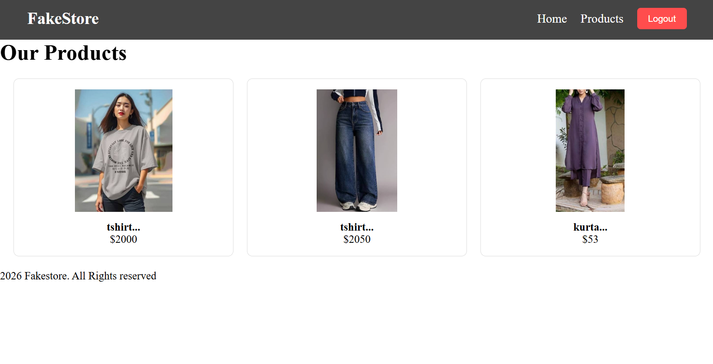

# 🛒 Fake-Store


A modern full-stack e-commerce web application built using **React.js, Django, Python, and Fake Store API**.

Fake-Store provides a smooth shopping experience where users can browse products, search items, view product details, and manage their shopping cart through a responsive interface.

---

# ✨ Features

- 🛍️ Browse products
- 🔍 Search products
- 📂 Category filtering
- 📄 Product details page
- 🛒 Add to cart functionality
- 📱 Responsive UI design
- ⚡ Fast React-based interface
- 🔗 API integration
- 🗃️ Django backend support

---

# 🛠️ Technologies Used

## Frontend
- React.js
- JavaScript
- HTML5
- CSS3
- React Router
- Axios

## Backend
- Python
- Django

## API
- Fake Store API

## Tools
- Git
- GitHub
- VS Code

---

# 📂 Project Structure

```
Fake-Store
│
├── frontend
│   └── React Application
│
├── backend
│   └── Django Application
│
└── README.md
```

---

# ⚙️ Installation & Setup

## Clone Repository

```bash
git clone https://github.com/bhavanamathapati233-cmd/Fake-Store.git
```

---

# Frontend Setup

Go to frontend folder:

```bash
cd frontend
```

Install dependencies:

```bash
npm install
```

Run React application:

```bash
npm run dev
```

---

# Backend Setup

Go to backend folder:

```bash
cd backend
```

Create virtual environment:

```bash
python -m venv env
```

Activate environment:

Windows:

```bash
env\Scripts\activate
```

Install dependencies:

```bash
pip install -r requirements.txt
```

Run Django server:

```bash
python manage.py runserver
```

---

# 📸 Screenshots

## 🏠 Home Page


## 🛍️ Products




---

# 🚀 Future Improvements

- User Authentication
- Payment Gateway
- Wishlist System
- Order History
- Admin Dashboard

---

# 👩‍💻 Author

**Bhavana Mathpati**

GitHub:
https://github.com/bhavanamathapati233-cmd